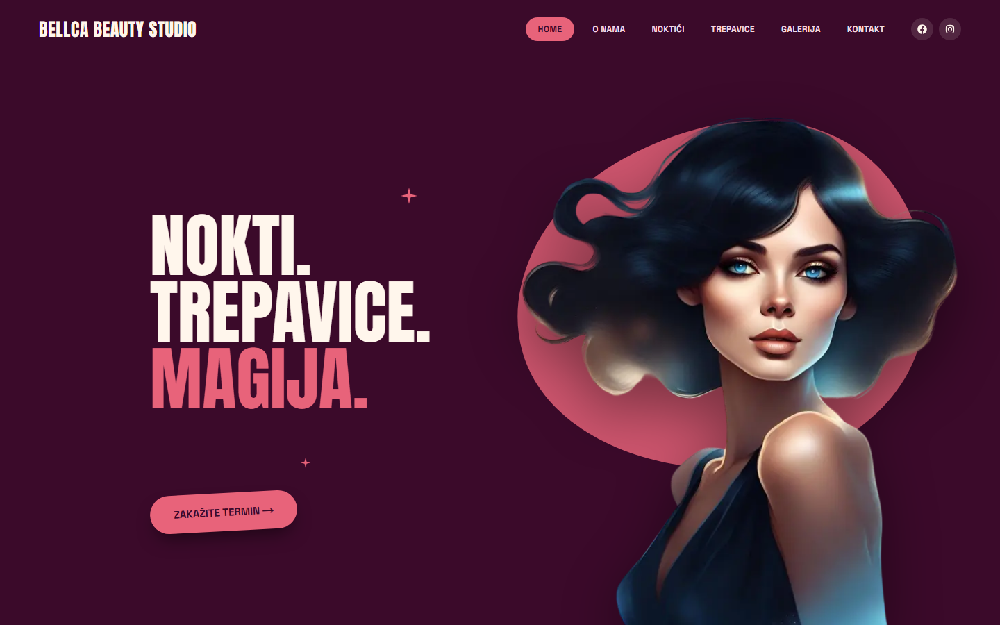
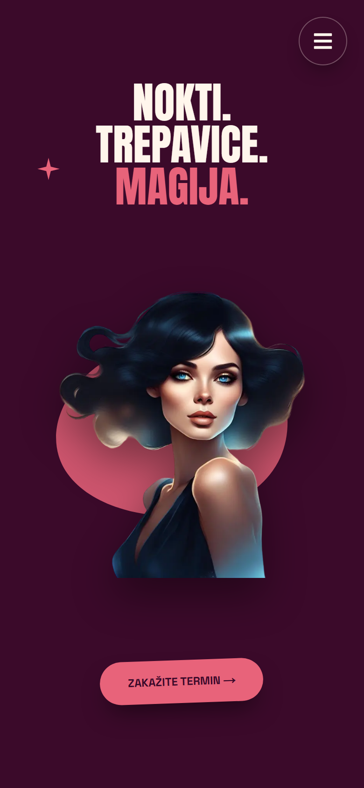

# Bellca Beauty Studio

Website for a real nail & lash studio in Novi Sad, Serbia.
Built with **Next.js 16 (App Router)** and **React 19**, styled with plain
CSS Modules, with no UI framework and no CSS library.

**[Live demo](https://beauty-salon-redesign.vercel.app/)**

Serbian-language site

<p align="center">
  
  &nbsp;
  
</p>

## About the project

The studio needed a site that feels like its brand (bold, playful,
"glam") and that turns visitors into bookings. The page walks a visitor
from the hero, through the studio's story, services and gallery, to a
contact panel where one tap opens SMS, Viber or Instagram.

Every section was first explored as design concepts (desktop, tablet and
phone), and the chosen one was then built section by section.

## Highlights

- **Server Components by default.** Only 5 small components run in the
  browser (`'use client'`): the navbars, the gallery, and two scroll
  helpers. Everything else is rendered on the server.
- **Custom gallery.** Two "polaroid decks" (nails and lashes) you can
  swipe through, built with Pointer Events and no carousel library. Each
  deck opens its own photos in a lightbox.
- **Responsive layouts with CSS Grid areas.** Each section names its
  areas once and rearranges them at three shared breakpoints
  (phone ≤767px · tablet 768–1099px · desktop 1100px+).
- **Accessible mobile menu.** A real `<button>` with `aria-expanded`,
  a drawer that is `inert` while closed, body scroll lock without
  layout shift, and auto-close when the window grows to desktop size.
- **Accessibility basics throughout.** Semantic landmarks, one `<h1>`,
  real links and buttons, visible focus rings, `lang="sr-Latn"`, and
  animations that respect `prefers-reduced-motion`.
- **SEO and link previews.** Metadata API with title, description,
  canonical URL and Open Graph / Twitter cards. The share image uses the
  `opengraph-image` file convention.
- **Performance.** `next/image` for every photo (priority-loaded hero),
  `next/font` for self-hosted fonts with no layout shift, and a drawn
  SVG map instead of a Google Maps iframe, so nothing from Google loads
  until someone clicks.

## Tech stack

|           |                                             |
| --------- | ------------------------------------------- |
| Framework | Next.js 16 (App Router), React 19           |
| Styling   | CSS Modules, CSS custom properties          |
| Fonts     | Anton + Space Grotesk via `next/font`       |
| Libraries | `react-icons`, `yet-another-react-lightbox` |
| Hosting   | Vercel                                      |

## Project structure

```
app/
  layout.js            fonts, <html lang>, site metadata
  page.jsx             the one-page site, section by section
  globals.css          brand colors and shared breakpoints
  opengraph-image.png  link-preview image (1200×630)
components/
  Hero, AboutUs, Services, Nails, Lashes, Gallery,
  Contact, Testimonials, Booking, Footer, Navbar, ...
  each with its own .module.css
public/
  about/ nails/ lashes/  studio and work photos
```

## Getting started

```bash
npm install
npm run dev
```

Then open http://localhost:3000.

## Deployment

Made for Vercel, with nothing to configure. The metadata reads Vercel's
built-in `VERCEL_PROJECT_PRODUCTION_URL`, so the canonical URL and
link-preview image always point to the project's production domain.
Locally they fall back to `localhost:3000`.

## Credits

Design & development: **Vladimir Milinić**

Client: Bellca Beauty Studio, Novi Sad
